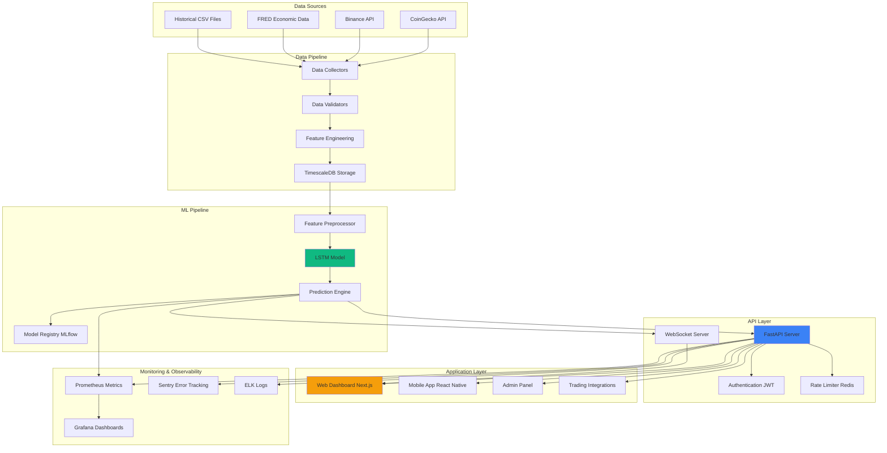

# Technical Architecture - Crypto Market Regime Classification

## System Architecture Overview



## Component Details

### 1. Data Collection Layer

**Purpose**: Ingest cryptocurrency market data from multiple sources

**Components**:

#### Data Collectors (`src/data/collectors/`)
```python
# Pseudo-code structure
class CoinGeckoCollector:
    def fetch_ohlcv(self, symbol: str, start_date: str, end_date: str)
    def fetch_market_cap(self, symbol: str)

class BinanceCollector:
    def fetch_realtime_data(self, symbol: str)
    def subscribe_to_websocket(self, symbols: List[str])

class EconomicDataCollector:
    def fetch_fred_data(self, series_id: str)
    def fetch_sp500_data(self)
```

**Technologies**:
- Python `requests` for REST APIs
- `websockets` for real-time Binance data
- `pandas` for data manipulation
- `Great Expectations` for data validation

**Data Flow**:
1. Scheduled jobs trigger data collection (via Celery)
2. Collectors fetch data from external APIs
3. Raw data stored in staging tables
4. Validation checks run on raw data
5. Validated data moved to production tables

---

### 2. Feature Engineering Pipeline

**Purpose**: Transform raw OHLCV data into ML-ready features

**Features Generated**:

#### Technical Indicators (`src/features/technical_indicators.py`)
- **Moving Averages**: SMA(7), SMA(20), EMA(12), EMA(26)
- **Momentum**: RSI(14), MACD
- **Volatility**: Bollinger Bands (20-day, ±2 std dev)

#### Temporal Features (`src/features/lag_features.py`)
- **Lag Features**: close_lag_1, close_lag_3, close_lag_5, close_lag_7
- **Volume Lags**: volume_lag_1, volume_lag_3

#### Statistical Features (`src/features/rolling_stats.py`)
- **Rolling Mean**: 7-day, 14-day, 21-day windows
- **Rolling Std**: 7-day, 14-day, 21-day windows

**Implementation**:
```python
class FeatureEngineer:
    def __init__(self, config: FeatureConfig):
        self.indicators = TechnicalIndicators()
        self.lag_builder = LagFeatureBuilder()
        self.stats = RollingStatistics()

    def transform(self, df: pd.DataFrame) -> pd.DataFrame:
        df = self.indicators.calculate_all(df)
        df = self.lag_builder.create_lags(df)
        df = self.stats.calculate_rolling(df)
        return df
```

**Processing Requirements**:
- Process per cryptocurrency (avoid data leakage)
- Handle missing values (forward fill)
- Normalize features (MinMaxScaler)

---

### 3. Model Architecture

**Model Type**: Bidirectional LSTM with Batch Normalization

#### Layer-by-Layer Breakdown

```
Input Shape: (10, 17)  # 10 timesteps, 17 features

Layer 1: Bidirectional(LSTM(64, return_sequences=True))
         Output: (10, 128)  # 64 forward + 64 backward

Layer 2: BatchNormalization()

Layer 3: Dropout(0.3)

Layer 4: Bidirectional(LSTM(64, return_sequences=False))
         Output: (128,)  # Final timestep only

Layer 5: BatchNormalization()

Layer 6: Dropout(0.3)

Layer 7: Dense(32, activation='relu')
         Output: (32,)

Layer 8: BatchNormalization()

Layer 9: Dropout(0.5)

Layer 10: Dense(3, activation='softmax')
          Output: (3,)  # [P(Bearish), P(Bullish), P(Neutral)]
```

#### Hyperparameters
```yaml
model:
  lstm_units: 64
  dense_units: 32
  dropout_rates: [0.3, 0.3, 0.5]
  sequence_length: 10

training:
  optimizer: Adam
  learning_rate: 0.001
  loss: categorical_crossentropy
  batch_size: 64
  epochs: 20

callbacks:
  early_stopping:
    monitor: val_loss
    patience: 5
  reduce_lr:
    monitor: val_loss
    factor: 0.5
    patience: 3
    min_lr: 0.0001
  model_checkpoint:
    monitor: val_accuracy
    save_best_only: true
```

**Training Process**:
```python
class ModelTrainer:
    def train(self, X_train, y_train, X_val, y_val):
        # 1. Compile model
        self.model.compile(
            optimizer=Adam(lr=0.001),
            loss='categorical_crossentropy',
            metrics=['accuracy']
        )

        # 2. Calculate class weights
        class_weights = compute_class_weight(
            'balanced',
            classes=np.unique(y_train),
            y=y_train
        )

        # 3. Train with callbacks
        history = self.model.fit(
            X_train, y_train,
            validation_data=(X_val, y_val),
            epochs=20,
            batch_size=64,
            class_weight=class_weights,
            callbacks=[early_stopping, reduce_lr, checkpoint]
        )

        return history
```

---

### 4. Prediction Engine

**Purpose**: Generate real-time regime classifications

**Prediction Flow**:
```
1. Receive prediction request
2. Fetch latest 10 days of data
3. Apply feature engineering
4. Scale features using fitted scaler
5. Reshape to (1, 10, 17)
6. Model inference
7. Post-process probabilities
8. Return regime + confidence
```

**Implementation**:
```python
class RegimePredictor:
    def __init__(self, model_path: str, scaler_path: str):
        self.model = load_model(model_path)
        self.scaler = joblib.load(scaler_path)
        self.feature_engineer = FeatureEngineer()

    def predict(self, symbol: str) -> RegimePrediction:
        # Fetch latest data
        df = self.data_loader.get_latest_data(symbol, days=10)

        # Feature engineering
        df = self.feature_engineer.transform(df)

        # Prepare sequence
        X = self.prepare_sequence(df)
        X_scaled = self.scaler.transform(X.reshape(-1, 17)).reshape(1, 10, 17)

        # Predict
        probabilities = self.model.predict(X_scaled)[0]
        regime = ['Bearish', 'Bullish', 'Neutral'][np.argmax(probabilities)]
        confidence = float(np.max(probabilities))

        return RegimePrediction(
            symbol=symbol,
            regime=regime,
            confidence=confidence,
            probabilities={
                'bearish': float(probabilities[0]),
                'bullish': float(probabilities[1]),
                'neutral': float(probabilities[2])
            },
            timestamp=datetime.utcnow()
        )
```

**Performance Optimization**:
- Model loaded once at startup (not per request)
- Scaler cached in memory
- Recent data cached in Redis (TTL: 5 minutes)
- ONNX Runtime for 3x faster inference

---

### 5. API Layer

**Technology**: FastAPI (async Python web framework)

#### Endpoints

```python
# GET /v1/regime/current?symbol=BTC
@app.get("/v1/regime/current")
async def get_current_regime(
    symbol: str,
    user: User = Depends(authenticate)
):
    """Get current regime for a cryptocurrency"""
    prediction = await predictor.predict(symbol)
    return {
        "symbol": symbol,
        "regime": prediction.regime,
        "confidence": prediction.confidence,
        "probabilities": prediction.probabilities,
        "timestamp": prediction.timestamp
    }

# GET /v1/regime/history?symbol=BTC&start=2024-01-01&end=2024-12-31
@app.get("/v1/regime/history")
async def get_regime_history(
    symbol: str,
    start_date: str,
    end_date: str,
    user: User = Depends(authenticate)
):
    """Get historical regime classifications"""
    regimes = await db.get_regime_history(symbol, start_date, end_date)
    return {"data": regimes}

# POST /v1/regime/portfolio
@app.post("/v1/regime/portfolio")
async def analyze_portfolio(
    portfolio: Portfolio,
    user: User = Depends(authenticate)
):
    """Analyze regime for entire portfolio"""
    results = []
    for holding in portfolio.holdings:
        prediction = await predictor.predict(holding.symbol)
        results.append({
            "symbol": holding.symbol,
            "allocation": holding.allocation,
            "regime": prediction.regime,
            "confidence": prediction.confidence
        })

    # Calculate portfolio-level regime score
    portfolio_score = calculate_portfolio_regime(results)

    return {
        "portfolio_regime": portfolio_score.regime,
        "portfolio_confidence": portfolio_score.confidence,
        "asset_breakdown": results
    }

# WebSocket /ws/regimes
@app.websocket("/ws/regimes")
async def websocket_regime_updates(websocket: WebSocket):
    """Real-time regime updates via WebSocket"""
    await websocket.accept()

    # Subscribe to Redis pub/sub
    pubsub = redis_client.pubsub()
    pubsub.subscribe('regime_updates')

    async for message in pubsub.listen():
        if message['type'] == 'message':
            await websocket.send_json(json.loads(message['data']))
```

#### Authentication & Security

```python
# JWT-based authentication
class AuthService:
    def create_token(self, user_id: str) -> str:
        payload = {
            'user_id': user_id,
            'exp': datetime.utcnow() + timedelta(hours=24)
        }
        return jwt.encode(payload, SECRET_KEY, algorithm='HS256')

    def verify_token(self, token: str) -> User:
        try:
            payload = jwt.decode(token, SECRET_KEY, algorithms=['HS256'])
            return get_user(payload['user_id'])
        except jwt.ExpiredSignatureError:
            raise HTTPException(401, "Token expired")
        except jwt.InvalidTokenError:
            raise HTTPException(401, "Invalid token")

# Rate limiting
@limiter.limit("100/minute")
@app.get("/v1/regime/current")
async def get_current_regime(...):
    pass
```

---

### 6. Database Schema

**Database**: PostgreSQL with TimescaleDB extension

#### Tables

```sql
-- Time-series data for OHLCV
CREATE TABLE ohlcv_data (
    id SERIAL PRIMARY KEY,
    symbol VARCHAR(10) NOT NULL,
    timestamp TIMESTAMPTZ NOT NULL,
    open NUMERIC(20, 8),
    high NUMERIC(20, 8),
    low NUMERIC(20, 8),
    close NUMERIC(20, 8),
    volume NUMERIC(30, 8),
    market_cap NUMERIC(30, 2)
);

-- Convert to hypertable for TimescaleDB
SELECT create_hypertable('ohlcv_data', 'timestamp');

-- Feature store
CREATE TABLE features (
    id SERIAL PRIMARY KEY,
    symbol VARCHAR(10) NOT NULL,
    timestamp TIMESTAMPTZ NOT NULL,
    feature_vector JSONB NOT NULL,  -- Stores all 17 features
    created_at TIMESTAMPTZ DEFAULT NOW()
);

SELECT create_hypertable('features', 'timestamp');

-- Regime predictions
CREATE TABLE regime_predictions (
    id SERIAL PRIMARY KEY,
    symbol VARCHAR(10) NOT NULL,
    timestamp TIMESTAMPTZ NOT NULL,
    regime VARCHAR(20) NOT NULL,
    confidence NUMERIC(5, 4),
    prob_bearish NUMERIC(5, 4),
    prob_bullish NUMERIC(5, 4),
    prob_neutral NUMERIC(5, 4),
    model_version VARCHAR(20),
    created_at TIMESTAMPTZ DEFAULT NOW()
);

SELECT create_hypertable('regime_predictions', 'timestamp');

-- Users and authentication
CREATE TABLE users (
    id UUID PRIMARY KEY DEFAULT gen_random_uuid(),
    email VARCHAR(255) UNIQUE NOT NULL,
    hashed_password VARCHAR(255),
    subscription_tier VARCHAR(20) DEFAULT 'free',
    api_key VARCHAR(64) UNIQUE,
    created_at TIMESTAMPTZ DEFAULT NOW(),
    last_login TIMESTAMPTZ
);

-- API usage tracking
CREATE TABLE api_usage (
    id SERIAL PRIMARY KEY,
    user_id UUID REFERENCES users(id),
    endpoint VARCHAR(255),
    timestamp TIMESTAMPTZ DEFAULT NOW(),
    response_time_ms INTEGER,
    status_code INTEGER
);

SELECT create_hypertable('api_usage', 'timestamp');

-- Indexes for performance
CREATE INDEX idx_ohlcv_symbol_timestamp ON ohlcv_data(symbol, timestamp DESC);
CREATE INDEX idx_regime_symbol_timestamp ON regime_predictions(symbol, timestamp DESC);
CREATE INDEX idx_api_usage_user ON api_usage(user_id, timestamp DESC);
```

---

### 7. Deployment Architecture

**Infrastructure**: Kubernetes on AWS EKS

```yaml
# Kubernetes Architecture
apiVersion: v1
kind: Namespace
metadata:
  name: crypto-regime

---
# API Deployment
apiVersion: apps/v1
kind: Deployment
metadata:
  name: api-server
  namespace: crypto-regime
spec:
  replicas: 3
  selector:
    matchLabels:
      app: api-server
  template:
    spec:
      containers:
      - name: api
        image: crypto-regime/api:latest
        ports:
        - containerPort: 8000
        resources:
          requests:
            memory: "512Mi"
            cpu: "500m"
          limits:
            memory: "1Gi"
            cpu: "1000m"
        env:
        - name: DATABASE_URL
          valueFrom:
            secretKeyRef:
              name: db-credentials
              key: url
        - name: MODEL_PATH
          value: "/models/best_crypto_model.h5"
        livenessProbe:
          httpGet:
            path: /health
            port: 8000
          initialDelaySeconds: 30
          periodSeconds: 10

---
# Horizontal Pod Autoscaler
apiVersion: autoscaling/v2
kind: HorizontalPodAutoscaler
metadata:
  name: api-server-hpa
  namespace: crypto-regime
spec:
  scaleTargetRef:
    apiVersion: apps/v1
    kind: Deployment
    name: api-server
  minReplicas: 3
  maxReplicas: 10
  metrics:
  - type: Resource
    resource:
      name: cpu
      target:
        type: Utilization
        averageUtilization: 70

---
# Service
apiVersion: v1
kind: Service
metadata:
  name: api-service
  namespace: crypto-regime
spec:
  selector:
    app: api-server
  ports:
  - protocol: TCP
    port: 80
    targetPort: 8000
  type: LoadBalancer
```

**AWS Services Used**:
- **EKS**: Kubernetes cluster
- **RDS**: PostgreSQL with TimescaleDB
- **ElastiCache**: Redis for caching
- **S3**: Model artifacts and backups
- **CloudWatch**: Logging and monitoring
- **ALB**: Application Load Balancer
- **Route 53**: DNS management
- **ACM**: SSL/TLS certificates

---

### 8. Monitoring & Observability

#### Metrics Collection (Prometheus)

```python
from prometheus_client import Counter, Histogram, Gauge

# Define metrics
prediction_counter = Counter(
    'regime_predictions_total',
    'Total number of regime predictions',
    ['symbol', 'regime']
)

prediction_latency = Histogram(
    'regime_prediction_latency_seconds',
    'Latency of regime predictions',
    ['symbol']
)

model_confidence = Gauge(
    'regime_model_confidence',
    'Confidence score of predictions',
    ['symbol', 'regime']
)

# Instrument code
@prediction_latency.time()
def predict_regime(symbol: str):
    prediction = predictor.predict(symbol)
    prediction_counter.labels(symbol=symbol, regime=prediction.regime).inc()
    model_confidence.labels(symbol=symbol, regime=prediction.regime).set(prediction.confidence)
    return prediction
```

#### Grafana Dashboards

**Dashboard 1: System Health**
- API request rate (req/sec)
- API latency (p50, p95, p99)
- Error rate (%)
- Active users
- Database connections

**Dashboard 2: Model Performance**
- Predictions per regime (pie chart)
- Average confidence per regime (gauge)
- Prediction latency (histogram)
- Model accuracy drift (line chart)

**Dashboard 3: Business Metrics**
- Daily active users
- API calls per tier (free/starter/pro)
- Revenue (MRR)
- Conversion funnel

---

### 9. CI/CD Pipeline

**GitHub Actions Workflow**:

```yaml
name: CI/CD Pipeline

on:
  push:
    branches: [main, develop]
  pull_request:
    branches: [main]

jobs:
  test:
    runs-on: ubuntu-latest
    steps:
      - uses: actions/checkout@v3

      - name: Set up Python
        uses: actions/setup-python@v4
        with:
          python-version: '3.11'

      - name: Install dependencies
        run: |
          pip install -r requirements.txt
          pip install -r requirements-dev.txt

      - name: Run tests
        run: pytest tests/ --cov=src --cov-report=xml

      - name: Run linting
        run: |
          flake8 src/
          black --check src/
          mypy src/

      - name: Upload coverage
        uses: codecov/codecov-action@v3

  build:
    needs: test
    runs-on: ubuntu-latest
    if: github.ref == 'refs/heads/main'
    steps:
      - uses: actions/checkout@v3

      - name: Build Docker image
        run: docker build -t crypto-regime/api:${{ github.sha }} .

      - name: Push to registry
        run: |
          echo ${{ secrets.DOCKER_PASSWORD }} | docker login -u ${{ secrets.DOCKER_USERNAME }} --password-stdin
          docker push crypto-regime/api:${{ github.sha }}

  deploy:
    needs: build
    runs-on: ubuntu-latest
    steps:
      - name: Deploy to Kubernetes
        run: |
          kubectl set image deployment/api-server api=crypto-regime/api:${{ github.sha }} -n crypto-regime
          kubectl rollout status deployment/api-server -n crypto-regime
```

---

## Performance Targets

| Metric | Target | Current |
|--------|--------|---------|
| API Latency (p95) | < 200ms | TBD |
| Throughput | 1000 req/sec | TBD |
| Model Accuracy | > 85% | 81.6% |
| Uptime | 99.9% | TBD |
| Prediction Latency | < 50ms | TBD |
| Data Freshness | < 5 min | TBD |

---

## Security Considerations

1. **API Security**:
   - JWT token authentication
   - Rate limiting per user/tier
   - API key rotation
   - HTTPS only (TLS 1.3)

2. **Data Security**:
   - Encrypted at rest (AWS KMS)
   - Encrypted in transit (TLS)
   - Database access via IAM roles
   - Regular security audits

3. **Model Security**:
   - Model versioning and rollback
   - Input validation
   - Output sanity checks
   - Adversarial input detection

4. **Infrastructure Security**:
   - Network policies in Kubernetes
   - Private VPC for database
   - Security groups and NACLs
   - Regular dependency updates

---

## Scalability Plan

### Current Capacity (MVP)
- 3 API pods
- 100 concurrent users
- 1,000 requests/minute
- 10 cryptocurrencies

### Scale Targets (Month 6)
- 10 API pods
- 1,000 concurrent users
- 10,000 requests/minute
- 50 cryptocurrencies

### Scale Targets (Month 12)
- 50 API pods (auto-scaled)
- 10,000 concurrent users
- 100,000 requests/minute
- 200+ cryptocurrencies

**Scaling Strategies**:
- Horizontal pod autoscaling (CPU & memory)
- Database read replicas (5+)
- Redis cluster for distributed caching
- CDN for static assets (CloudFront)
- Multi-region deployment (US, EU, APAC)

---

**Document Version**: 1.0
**Last Updated**: 2025-11-19
